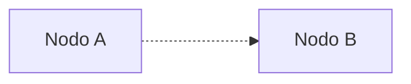

# Change title.

The first class of Abstract Algebra was about the definition of a group. A group is a set $G$ with a binary operation $*$ such that:

1. $*$ is associative: $(a*b)*c = a*(b*c)$
2. There is an identity element $e$ such that $a*e = e*a = a$
3. For every element $a$ there is an inverse element $a^{-1}$ such that $a*a^{-1} = a^{-1}*a = e$

The first example of a group is the set of integers $\mathbb{Z}$ with the operation of addition $+$. The identity element is $0$ and the inverse of $a$ is $-a$.

The second example of a group is the set of integers $\mathbb{Z}$ without $0$ with the operation of multiplication $\cdot$. The identity element is $1$ and the inverse of $a$ is $1/a$.

The third example of a group is the set of integers $\mathbb{Z}$ without $0$ with the operation of division $\div$. The identity element is $1$ and the inverse of $a$ is $1/a$.

# Abstract Algebra, second class.

The second class of Abstract Algebra was about the definition of a ring. A ring is a set $R$ with two binary operations $+$ and $\cdot$ such that:

1. $(R,+)$ is an abelian group.
2. $\cdot$ is associative: $(a\cdot b)\cdot c = a\cdot (b\cdot c)$
3. $\cdot$ is distributive: $a\cdot (b+c) = a\cdot b + a\cdot c$ and $(a+b)\cdot c = a\cdot c + b\cdot c$
